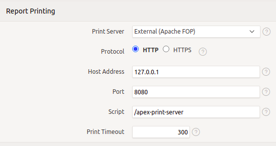

# apex-print-server
Apache FOP external Print Server for Oracle APEX

## Description
This is a simple external FOP Print Server to be used by Oracle APEX.
It can only be used to print PDF Documents with a FOP Stylesheet.

The FOP Print Server is just a simple WAR-File which will run
next to ORDS on the same Apache Tomcat.

## Prerequisites
* Java 8 (JDK to create the WAR-File)
* Tomcat 7 or higher
* Oracle APEX
* optional: ORDS (Oracle REST Data Services)

## Installation
To create start the build with `./mvn clean package` and copy 
`target/apex-print-server.war` to the WebApps Directory alongside of `ords.war`.

## Tomcat Setup
You have to add the HTTP/1.1 Connector in `conf/server.xml`.
```
<Connector port="8080" 
           protocol="HTTP/1.1"
           maxPostSize="31457280" />
```
For Security Reasons I recommend to use Apache HTTP Server as a Reverse Proxy in the
Front and use the AJP-Tunnel to communicate with the Apache Tomcat.
The HTTP/1.1 Connector can then be used only for localhost (use `address="127.0.0.1"`
on the above Connector) when the Database runs on the same Host as Apache Tomcat.

By Default the `maxPostSize` is 2M. This can be too less for big Reports.
So I recommend to increase `maxPostSize` to at least 30M (`maxPostSize="31457280"`).

## APEX Setup
Connect to the APEX Instance Administration, then go to `Manage Instance -> Instance Settings`.

Set the following Values on the Section `Report Printing`:


Alternatively you can call `APEX_INSTANCE_ADMIN.set_parameter` to set the necessary Parameters:
```
BEGIN
  APEX_INSTANCE_ADMIN.set_parameter('PRINT_BIB_LICENSED', 'STANDARD');
  APEX_INSTANCE_ADMIN.set_parameter('PRINT_SVR_HOST', '127.0.0.1');
  APEX_INSTANCE_ADMIN.set_parameter('PRINT_SVR_PORT', '8080');
  APEX_INSTANCE_ADMIN.set_parameter('PRINT_SVR_PROTOCOL', 'http');
  APEX_INSTANCE_ADMIN.set_parameter('PRINT_SVR_SCRIPT', '/apex-print-server');
END;
/
COMMIT;
```

## Oracle Setup
You have to authorize the Oracle Database that Oracle APEX can communicate with the
Apache Tomcat.

```
-- must be executed by a User with DBA Privileges
BEGIN
    DBMS_NETWORK_ACL_ADMIN.APPEND_HOST_ACE(
        host => '127.0.0.1', -- or just use '*'
        ace => xs$ace_type(privilege_list => xs$name_list('connect'),
                           principal_name => 'APEX_200100',
                           principal_type => xs_acl.ptype_db));
END;
/
COMMIT;
```
